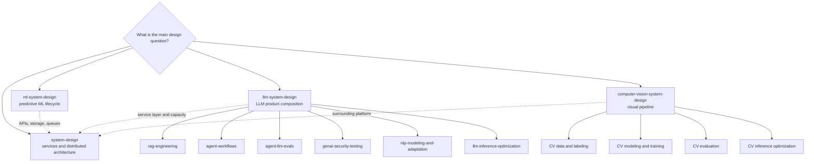

# Codex Pro Agent Skills


A practical library of focused skills for professional Codex work: system design,
software delivery, product and business decisions, ML, LLMs, agents, computer vision,
mobile development, and technical communication.

A skill is a reusable set of instructions that helps Codex approach a particular kind
of task. A bundle is a convenient installation group. You do not need to install
everything: start with the general-purpose `base` bundle, then add only the areas you
actually use.

## Find The Skills You Need

The library is organized into a small number of recognizable areas. Some skills
appear in more than one bundle because real projects cross domain boundaries.

| Area | What it helps with | Useful bundles |
|---|---|---|
| Core engineering and systems | Service architecture, maintainable software, QA, and production reliability | `base`, `service-platform` |
| Product, UX, and business strategy | User research, flows, prototype validation, design systems, business cases, and strategic choices | `product-and-consulting` |
| Classical ML and NLP | Predictive ML lifecycle, data, validation, text-model selection, and adaptation | `classic-ml` |
| LLM products and platforms | Prompt, RAG, and agent choices; model routing, adaptation, serving, cost, and latency | `llm-product`, `llm-platform`, `llm-adaptation` |
| Agents, evaluation, and GenAI safety | Agent workflows, evals, defensive security testing, and independent model review | `agent-systems` |
| Computer vision | Visual task design, datasets, training, evaluation, deployment, and inference | `computer-vision-core`, `computer-vision-training`, `computer-vision-systems`, `computer-vision-all` |
| Writing and communication | Explanations, research, summaries, decisions, documentation, plans, and presentations | `base`, `writing-specialists` |
| Apps and mobile platforms | iOS, Swift, Flutter, and Telegram Mini Apps | `ios-apps`, `telegram-mini-apps` |

Computer vision and other specialist domains are optional. They are not included in
`base`, which keeps the default skill selection compact.

## How Skill Routing Works

The repository is physically flat: every skill lives in `skills/<skill-name>`. Its
logical structure comes from routing between skills.

Codex starts with the skill that owns the unresolved decision. It then loads a
specialist or companion only when that part of the task needs deeper treatment.
`system-design` is therefore not a mandatory parent of every architecture skill: it
owns APIs, storage, queues, service boundaries, and distributed-system concerns,
while ML, LLM, and CV skills own their domain-specific decisions.



Solid arrows show a route to a domain or specialist. Dashed arrows show when a domain
skill may add classical `system-design` for the surrounding service. They do not
represent inheritance or an automatic runtime pipeline.

For the complete ownership and handoff rules, see the
[skill catalog](CATALOG.md).

In day-to-day use, describe the task normally and let Codex choose the primary skill.
When you want a specific route, name it explicitly, for example:
`$computer-vision-system-design`. The skill will hand off narrower parts of the work
only when they are relevant.

## Install Skills

### Quick Start

Install the compact general-purpose bundle:

```bash
git clone https://github.com/BejeweledMe/codex-pro-agent-skills.git
cd codex-pro-agent-skills
./scripts/install-bundle.sh --bundle base --run
```

The helper expects Git, Python 3, Ruby, and the official Codex skill installer in its
default Codex location.

Restart Codex after installing or updating skills so it can discover the new files.

<details>
<summary><strong>Choose a bundle</strong></summary>

Run this command to see the current bundle list:

```bash
./scripts/install-bundle.sh --list
```

| Bundle | Intended work |
|---|---|
| `base` | General engineering and writing |
| `writing-specialists` | Full writing, research, decision, and presentation family |
| `product-and-consulting` | Product design, UX, business framing, and stakeholder decisions |
| `service-platform` | Classical systems, delivery, QA, and reliability |
| `classic-ml` | Predictive ML and text-model selection or adaptation |
| `computer-vision-core` | The five CV decision owners without the general engineering stack |
| `computer-vision-training` | CV data, training, adaptation, and evaluation |
| `computer-vision-systems` | Production CV serving, quality, and reliability |
| `computer-vision-all` | The complete CV vertical with its engineering companions |
| `llm-product` | User-facing LLM products, RAG, agents, evaluation, and security |
| `llm-platform` | Self-hosted LLM serving and platform operations |
| `llm-adaptation` | Text or LLM adaptation, evaluation, and deployment |
| `agent-systems` | Agent workflows, evaluation, safety, and production controls |
| `ios-apps` | iOS, Swift, Flutter, and mixed-stack application work |
| `telegram-mini-apps` | Telegram Mini App development and release |
| `all` | Every skill currently published by this repository |

The machine-readable source of truth is [bundles.yaml](bundles.yaml).

</details>

<details>
<summary><strong>Combine several bundles</strong></summary>

Bundles can be combined. Shared skills are automatically deduplicated:

```bash
./scripts/install-bundle.sh \
  --bundle base \
  --bundle llm-product \
  --run
```

Without `--run`, the helper only prints the official installer command. This is
useful when you want to inspect the exact paths before installing them.

Examples of focused installations:

```bash
./scripts/install-bundle.sh --bundle classic-ml --run
./scripts/install-bundle.sh --bundle computer-vision-core --run
./scripts/install-bundle.sh --bundle computer-vision-training --run
./scripts/install-bundle.sh --bundle computer-vision-systems --run
./scripts/install-bundle.sh --bundle llm-platform --run
./scripts/install-bundle.sh --bundle agent-systems --run
./scripts/install-bundle.sh --bundle ios-apps --run
```

</details>

<details>
<summary><strong>Update installed skills with <code>--replace</code></strong></summary>

First update the cloned repository, then reinstall the selected bundles explicitly:

```bash
git pull --ff-only
./scripts/install-bundle.sh \
  --bundle base \
  --bundle llm-product \
  --run \
  --replace
```

The official installer does not overwrite an existing skill directory. With
`--replace`, the repository helper downloads the complete selection into a staging
directory, backs up only the affected installed skills under
`~/.codex/skills/.bundle-backups/<timestamp>/`, and then installs their replacements.

</details>

<details>
<summary><strong>Install one skill directly with the official installer</strong></summary>

Use an explicit repository path when you need only one skill:

```bash
python3 ~/.codex/skills/.system/skill-installer/scripts/install-skill-from-github.py \
  --method git \
  --repo BejeweledMe/codex-pro-agent-skills \
  --path skills/llm-system-design
```

Replace `skills/llm-system-design` with another directory from this repository. For
multiple skills, the installer accepts multiple paths after `--path`.

Use the bundle helper when you need updates with backups; `--replace` belongs to the
helper, not to the official installer.

</details>

<details>
<summary><strong>Install every skill</strong></summary>

```bash
./scripts/install-bundle.sh --bundle all --run
```

Install `all` only when the same Codex environment genuinely works across most
domains. A smaller selection makes routing easier and reduces unrelated skill
matches.

</details>

## Explore The Individual Skills

<details>
<summary><strong>Core engineering and systems</strong></summary>

- `system-design`: Services, APIs, storage, queues, capacity, and distributed systems.
- `software-engineering`: Long-lived software design, safe changes, testing, and delivery.
- `qa-testing`: Software QA strategy, automated suites, and quality gates.
- `sre-reliability-engineering`: SLOs, observability, incidents, on-call, and reliability.

</details>

<details>
<summary><strong>Product, UX, and business strategy</strong></summary>

- `product-design`: The product-designer route. It turns user evidence into product
  flows, interaction behavior, UI/UX requirements, prototype design and validation,
  and design-system decisions for web, mobile, and AI-assisted experiences. It works
  alongside product management and hands implementation to the appropriate
  engineering skill.
- `business-product-consulting`: The business and strategy route. It frames business
  cases, market or portfolio choices, operating models, ownership, alternatives,
  metrics, and executive recommendations.

Design systems belong to `product-design`; they are not a separate top-level skill or
installation bundle.

</details>

<details>
<summary><strong>Classical ML and NLP</strong></summary>

- `ml-system-design`: Predictive and classical ML from problem framing and data
  through validation, training, serving, monitoring, and drift.
- `nlp-modeling-and-adaptation`: Rules, retrieval baselines, encoder models,
  rerankers, fine-tuning, and text-model adaptation.

</details>

<details>
<summary><strong>LLM products and platforms</strong></summary>

- `llm-system-design`: LLM product composition, provider and model routing, prompt,
  RAG, agent or adaptation choices, budgets, and fallbacks.
- `rag-engineering`: Ingestion, retrieval, reranking, grounding, diagnostics, and
  release of RAG systems.
- `llm-inference-optimization`: Self-hosted LLM latency, throughput, batching,
  quantization, capacity, and cost.

Text-model training and adaptation route to `nlp-modeling-and-adaptation`.

</details>

<details>
<summary><strong>Agents, evaluation, and GenAI safety</strong></summary>

- `agent-workflows`: Agent control loops, tools, state, handoffs, and recovery.
- `agent-llm-evals`: LLM and agent evaluation, graders, traces, regression, and
  release gates.
- `genai-security-testing`: Defensive hardening and authorized testing of LLM, RAG,
  and agent systems.
- `llm-council`: Independent multi-model review and synthesis.

</details>

<details>
<summary><strong>Computer vision</strong></summary>

- `computer-vision-system-design`: Visual problem framing, sensors, task selection,
  and end-to-end perception pipelines.
- `computer-vision-data-and-labeling`: Collection, annotation schemas, label QA,
  leakage-safe splits, augmentation, and active learning.
- `computer-vision-modeling-and-training`: Model-family choice, transfer learning,
  fine-tuning, metric learning, OCR, and VLM adaptation.
- `computer-vision-evaluation`: Metrics, thresholds, visual error analysis,
  calibration, slices, robustness, and release evidence.
- `computer-vision-inference-optimization`: Profiling, preprocessing, video timing,
  conversion, compression, and non-LLM CV deployment.

</details>

<details>
<summary><strong>Writing and communication</strong></summary>

- `information-writing`: Shared discipline for substantive answers and informational
  writing.
- `information-editing`: Copyediting, faithful rewriting, restructuring, and
  compression.
- `information-source-summary`: Faithful summaries of supplied sources.
- `information-research-synthesis`: Multi-source and external research synthesis.
- `information-explanation`: Clear explanations that build a usable mental model.
- `information-decision-support`: Alternative comparison and defensible
  recommendations.
- `audience-adaptation`: Technical, nontechnical, executive, and execution reader modes.
- `technical-writing`: Documentation, design docs, runbooks, benchmarks, and
  engineering analysis.
- `execution-writing`: Status reports, decision memos, and execution plans.
- `information-presentation`: Claim-driven presentations and speaker notes.

</details>

<details>
<summary><strong>Apps and mobile platforms</strong></summary>

- `ios-app-development`: Cross-stack iOS product and architecture decisions.
- `swift-skill`: Native Swift, SwiftUI, UIKit, concurrency, testing, and release.
- `flutter-skill`: Flutter architecture, iOS integration, testing, and release.
- `telegram-mini-apps`: Telegram Mini App architecture, authentication, payments,
  testing, and production readiness.

</details>

## Repository Structure

```text
skills/<skill-name>/SKILL.md     Compact entry point and routing rules
skills/<skill-name>/references/ Detail loaded only when the task needs it
bundles.yaml                    Machine-readable installation groups
CATALOG.md                      Ownership, hierarchy, and handoff conventions
scripts/install-bundle.sh       Bundle installation and explicit updates
```

<details>
<summary><strong>Adding or changing a skill</strong></summary>

Keep each skill in a flat `skills/<skill-name>/` directory. Its YAML `name` must match
the directory name.

Give the skill:

- a concise description that helps Codex select it;
- one clear primary responsibility;
- explicit handoffs to adjacent owners;
- a compact `SKILL.md`;
- narrow references only where progressive disclosure is useful.

Then update [bundles.yaml](bundles.yaml) and [CATALOG.md](CATALOG.md), and run the
repository validation scripts before publishing.

</details>
